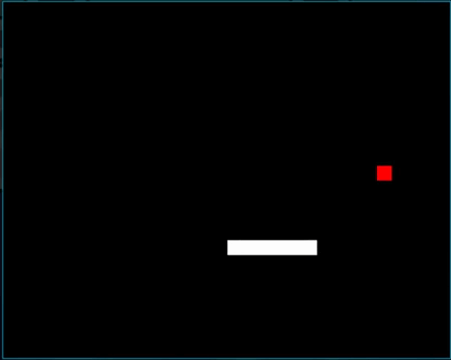

# Snake

This is an example application for [sdl2](https://hackage.haskell.org/package/sdl2).

Click on the SDL module in the link for a tutorial on how to get started with sdl2.

## Gameplay



## Build and Run

### Prerequisites

You will need to install [Stack](https://haskellstack.org).

You will also need sdl2 libraries:

> Note: You don't have to install ttf, image and mixer for this snake game to work, but you might want to use fonts, images and sounds later.

#### Ubuntu

```sh
sudo apt install libsdl2-dev libsdl2-ttf-dev libsdl2-image-dev libsdl2-mixer-dev
```

#### OS X

```sh
brew install sdl2 sdl2_ttf sdl2_image sdl2_mixer
```

#### Windows

```sh
stack exec -- pacman -Syu
stack exec -- pacman -S mingw-w64-x86_64-pkg-config mingw-w64-x86_64-SDL2 mingw-w64-x86_64-SDL2_image mingw-w64-x86_64-SDL2_ttf mingw-w64-x86_64-SDL2_mixer
```

### Build and Run

#### Stack

```sh
stack build && stack exec app
```

## Want to tinker with this game? Here are a few ideas

- Do nothing when the user tries to move to the direction the snake is coming from instead of failing
- Change the snake's speed
- Add a key to restart the game
- Keep score and report to the user
- Add obstacles
- Play a sound when the snake eats the apple
- Report game over to the game window instead of to the console
